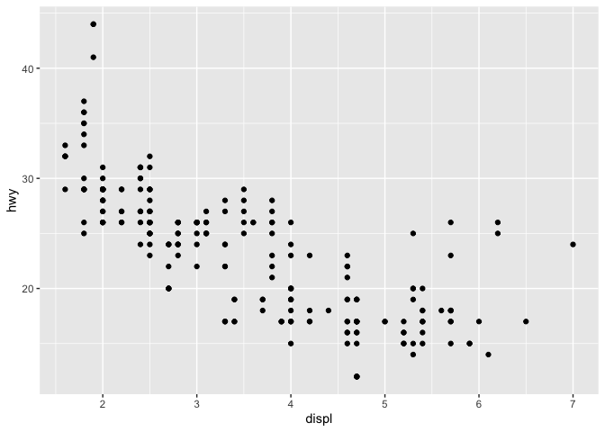

test
================
wanglingjie
2019/08/09

``` r
ggplot(data = mpg) +
  geom_point(aes(displ, hwy))
```

<!-- --> <br> <br>

##### 第二题

``` r
ggplot(data = mpg) +
  geom_point(aes(displ, hwy))
```

<!-- -->
